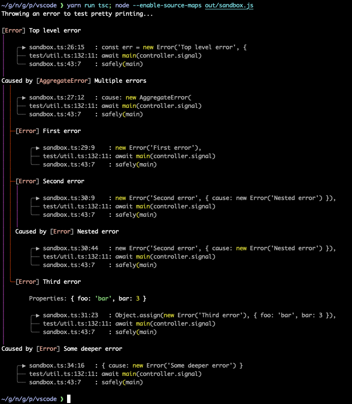
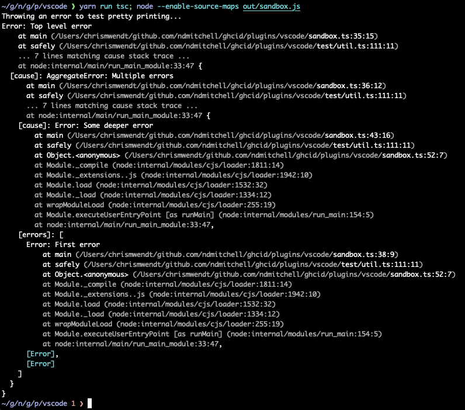

# pretty-error-tree

Pretty-prints Node.js `Error` objects in a tree style.

- Shows lines of source code
- Flattens nested causes
- Shortens file paths
- Highlights function names
- Colors the output



Here's the default Node.js error output for comparison:



## Installation

```bash
yarn add pretty-error-tree@chrismwendt/pretty-error-tree
```

## Usage

Pretty-print an error:

```ts
import { prettyErrorTree } from 'chrismwendt/pretty-error-tree'

try {
  throw new Error('foo')
} catch (err) {
  console.log(prettyErrorTree(err))
}
```

Install a global handler for uncaught errors:

```ts
import { installPrettyErrorTree } from 'chrismwendt/pretty-error-tree'

installPrettyErrorTree() // Now all uncaught errors will be pretty-printed

throw new Error('foo') // This will be pretty-printed
```
